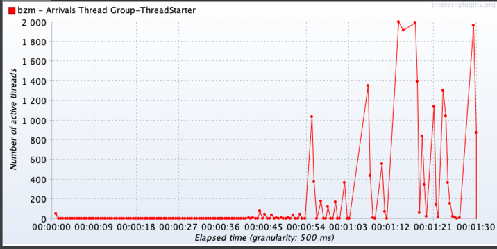
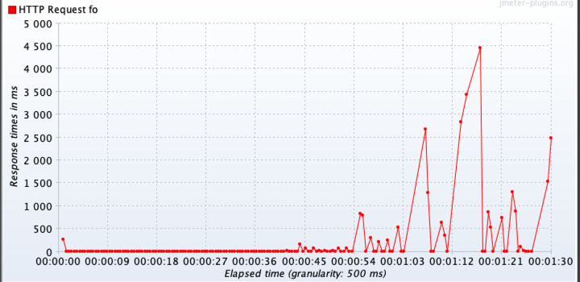
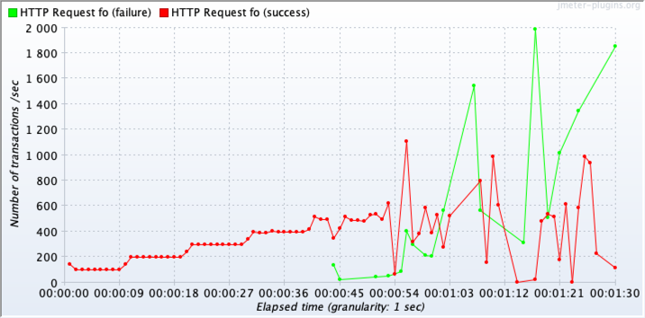
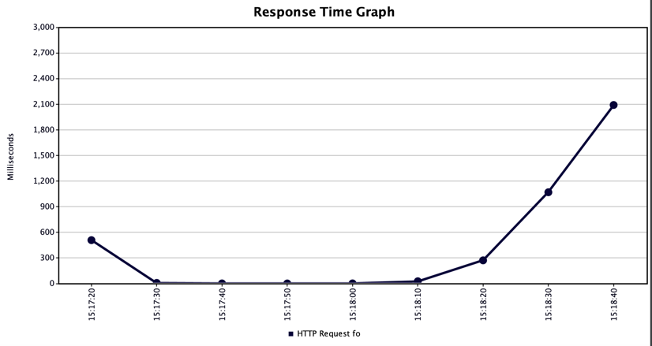
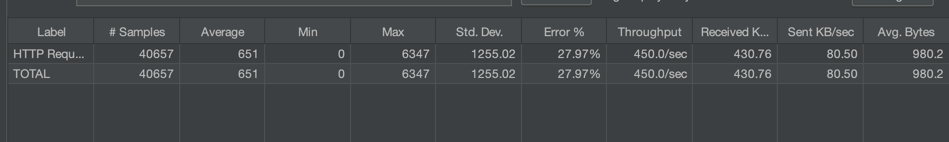
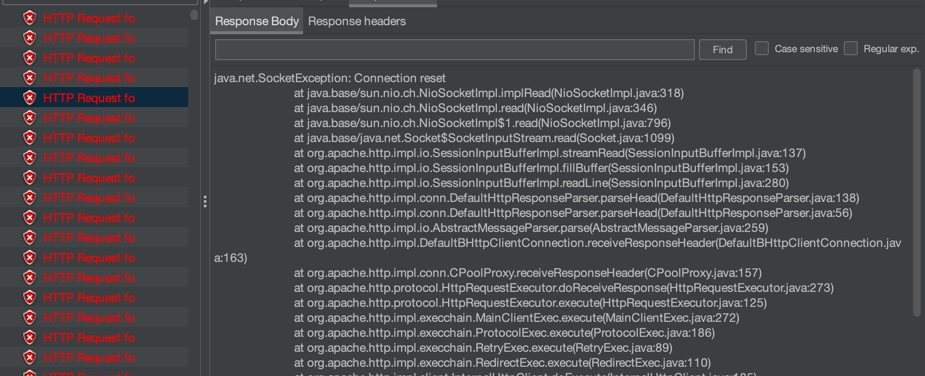

# Project Introduction

### develop environment

```
IntelliJ IDEA 2024.3.5 (Community Edition

Maven 3

% java --version
openjdk 21.0.6 2025-01-21 LTS
OpenJDK Runtime Environment Corretto-21.0.6.7.1 (build 21.0.6+7-LTS)
OpenJDK 64-Bit Server VM Corretto-21.0.6.7.1 (build 21.0.6+7-LTS, mixed mode, sharing)

```

### quick start

```
mvn clean && mvn package
docker build -t testdemo:v1 .
docker run -d -p 80:8080 --name mytestdemo testdemo:v1

open browser and visit localhost/api/transactions
you will find a json response: emtpy array
```

### about stress test
simply tested on a MacBook Pro (Retina, 13-inch, Early 2015)
* 2.7 GHz 双核Intel Core i5
* 8 GB 1867 MHz DDR3
* while server side is on this exact machine too.






#### when request failure occurs:
* the number of active thread increase
* time of responding consumes more
* more fail requests,more response time consumes,more threads activated



#### stress test conclusion:
* max stable throughput/second: around 450
* max stable active threads: 1
* average time consume when stable: 2ms~3ms

### possible optimizations


* monitor the server-side memory usage and cpu usage over time when stress test
* running on separated server-side machine, avoid effected by other processes
* to find the reason of connection reset, maybe trash-collection Stop-The-World
* will it improve when using another server instead of tomcat? like Jetty、Undertow
